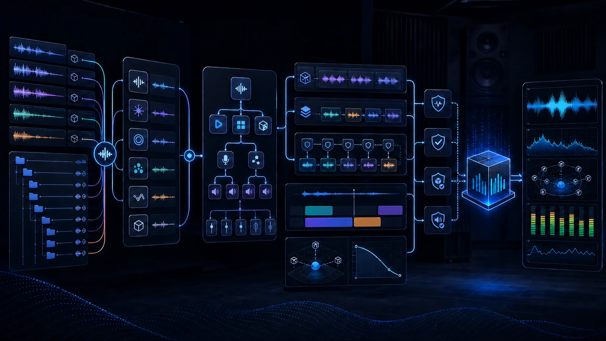

# dcc-mcp-wwise

<p align="center">
  <picture>
    <source media="(prefers-color-scheme: dark)" srcset="docs/assets/dcc-mcp-wwise-dark.svg">
    <source media="(prefers-color-scheme: light)" srcset="docs/assets/dcc-mcp-wwise.svg">
    
  </picture>
</p>

Typed [DCC-MCP](https://github.com/dcc-mcp/dcc-mcp-core) adapter for
Audiokinetic Wwise Authoring. It connects to Wwise's official loopback WAAPI
endpoint, binds discovery to the concrete Wwise process, and exposes
progressively loaded tools for project inspection, Sound SFX and Music Segment
imports, Random/Sequence Containers, Events, properties and references,
Switch/State-driven SFX and music, RTPC curves, connected-game profiler
sessions, SoundBank/ProjectInfo reconciliation, Work Unit source control,
saves, and bounded audible previews. While the adapter is connected, Wwise also exposes a
session-scoped **DCC-MCP** menu for the project repository and playable audio
showcase.



_Illustrative workflow generated with OpenAI ImageGen from the retained source in `showcase/sources`; live WAAPI and audible-playback evidence is documented separately in the reproducible audio showcase._

## Quick start

Requirements: Wwise 2024.1+ with **Project > User Preferences > Enable Wwise
Authoring API** enabled, Python 3.10+, and `dcc-mcp-core` 0.20.14+.

Do not infer publication from a source version or release tag. Require the
version-independent [PyPI project JSON](https://pypi.org/pypi/dcc-mcp-wwise/json)
to resolve the intended non-yanked wheel and sdist before using the command
below. The Core catalog entry is still pending, so catalog installation must
remain disabled until Core lands a digest-pinned entry. PyPI Trusted Publisher
configuration is an external repository gate and is not established by
repository code. This release workflow has not been validated against a real
Wwise Authoring/WAAPI session.

```text
python -m pip install --upgrade dcc-mcp-wwise
dcc-mcp-wwise doctor --json
```

The PID-less probe is preflight-only. Bind verification and the service to the
same independently observed Wwise process before claiming readiness:

```powershell
$wwisePid = (Get-Process Wwise | Where-Object MainWindowTitle -Like '*your-project*').Id
dcc-mcp-wwise verify --json --host-pid $wwisePid --timeout-ms 5000
dcc-mcp-wwise --host-pid $wwisePid
```

Control always follows the typed CLI flow:

```powershell
dcc-mcp-cli list
dcc-mcp-cli search --query "Wwise project info" --dcc-type wwise
dcc-mcp-cli load-skill wwise-project --dcc-type wwise
dcc-mcp-cli describe <returned-tool-slug>
dcc-mcp-cli call <returned-tool-slug> --json '{}' --wait
```

See [install.md](install.md) for publication gates, Windows/macOS/Linux setup,
WAAPI endpoint policy, stable doctor exits, upgrade, uninstall, and troubleshooting, and
[showcase/audio/README.md](showcase/audio/README.md) for the reproducible audio showcase.

## Audio showcase

- [▶ Play UI Confirm](https://dcc-mcp.github.io/showcase/wwise#ui-confirm)
- [▶ Play Sci-Fi Impact](https://dcc-mcp.github.io/showcase/wwise#sci-fi-impact)
- [▶ Play Neon Circuit BGM](https://dcc-mcp.github.io/showcase/wwise#neon-circuit-bgm)
- [Footstep variation source WAVs](showcase/audio/README.md#gameplay-footstep-variations)

The footstep example batch-imports three deterministic WAVs into a step-mode
Random Container, assigns its Output Bus, creates and previews
`Play_Footsteps`, then generates a Windows `Gameplay` SoundBank.

The installable `wwise-audio` Skill also contains an
[end-to-end RPG workflow](src/dcc_mcp_wwise/skills/wwise-audio/references/RPG_GAME_AUDIO_WORKFLOW.md)
for dynamic music, surface Switches, RTPCs, Events, engine handoff, profiling,
and team source control.

## Runtime shape

```text
dcc-mcp-cli -> DCC-MCP gateway -> dcc-mcp-wwise -> official waapi-client -> Wwise
```

The adapter does not embed Python into Wwise, create another gateway, or expose
arbitrary script execution. The service row is bound to the Wwise host PID, so
it becomes invalid when that authoring instance exits.

## Development

```powershell
vx uv sync --extra dev
vx uv run ruff check src tests tools
vx uv run ruff format --check src tests tools
vx uv run pytest
vx uv run python tools/lint_skills.py
```
